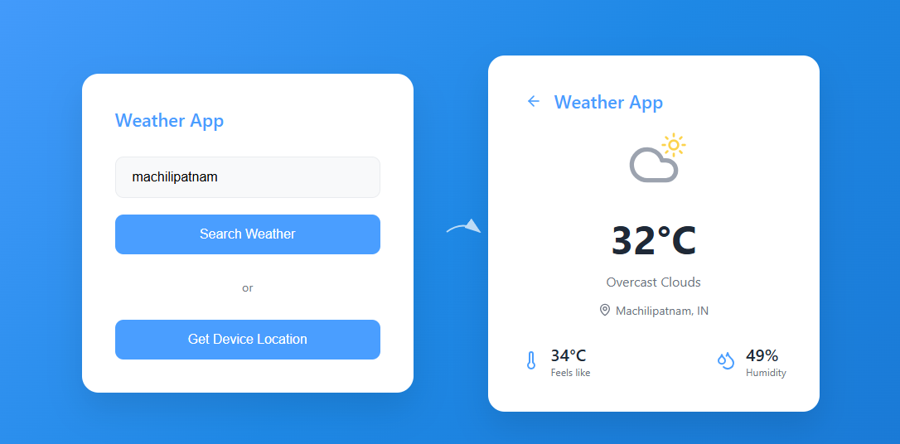

# Weather App

A modern, responsive weather application built with React that provides current weather information for any city worldwide.

## Features

- **City Search**: Search for weather information by entering any city name
- **Device Location**: Get weather data for your current location with one click
- **Responsive Design**: Clean, modern interface that works on all devices
- **Real-time Data**: Current weather conditions including temperature, humidity, and weather description
- **Visual Weather Icons**: Intuitive weather condition representations

## Screenshots

### Home Screen

*Main interface with search functionality and location options*

### Weather Display

*Weather information display showing temperature, conditions, and additional details*

## Technology Stack

- **Frontend**: React
- **Styling**: Modern CSS with responsive design
- **Icons**: Weather condition icons
- **API**: Weather data integration
- **Deployment**: Vercel


## Usage

1. **Search by City**: Enter a city name in the search field and click "Search Weather"
2. **Use Current Location**: Click "Get Device Location" to get weather for your current location
3. **View Results**: See current temperature, weather conditions, humidity, and "feels like" temperature

## Project Structure

```
weather-app/
├── public/
├── src/
│   ├── components/
│   ├── styles/
│   └── App.js
├── package.json
└── README.md
```

## Contributing

1. Fork the repository
2. Create your feature branch (`git checkout -b feature/AmazingFeature`)
3. Commit your changes (`git commit -m 'Add some AmazingFeature'`)
4. Push to the branch (`git push origin feature/AmazingFeature`)
5. Open a Pull Request

